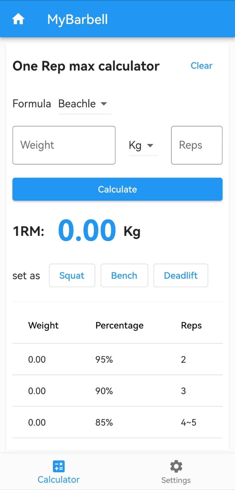
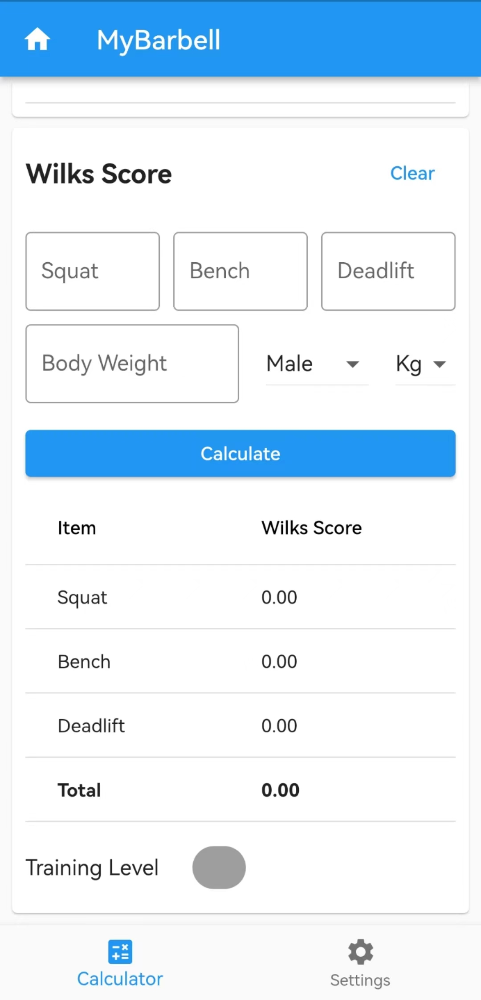
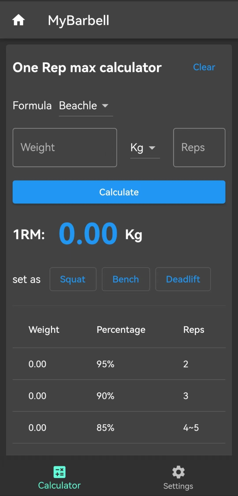
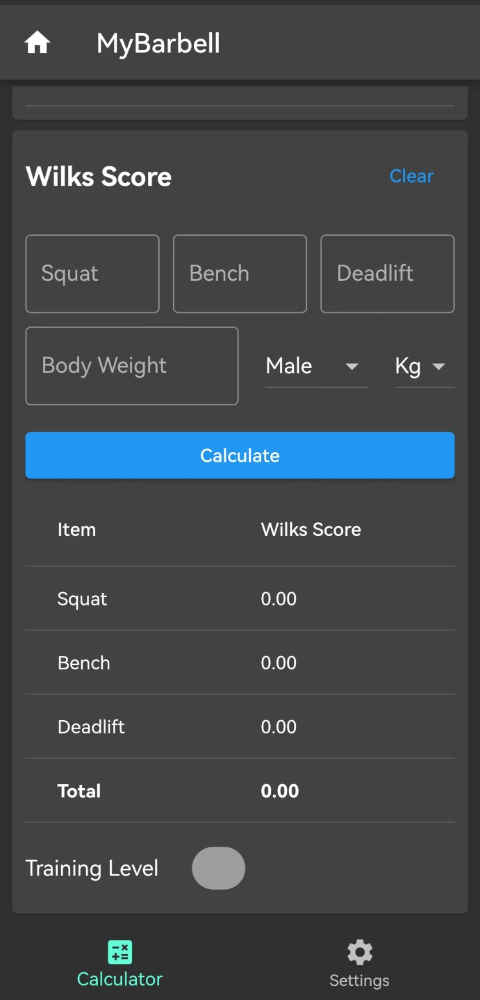

# mybarbell

- flutter
- material design
- cross-platform


## Getting Started

- flutter

## Development

- generate l10n

```bash
flutter gen-l10n
```

## Build

- build for android

```bash
flutter build apk --release
```

- build for windows

```bash
flutter build windows --release
```

## TODO

- [x] 1RM calculator
- [x] Wilks Score 1.0
- [x] Wilks Score 2.0
- [x] Dots Score
- [x] IPF Score
- [x] IPF GL Score
- [x] multi language
- [ ] calculate history
- [ ] plan page


## light

|  |  |
|---------------------------|---------------------------|

## dark
|  |  |
|--------------------------|--------------------------|

